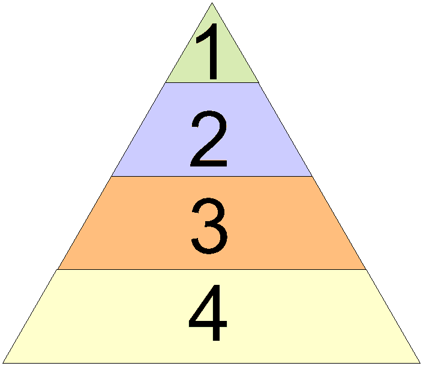
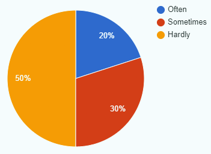

# Hoorcollege A&FO 22/09/2021

## Inhoud

-   [Falende Projecten](#falende-projecten)
-   [Requirements Analyse](#requirements-analyse)
-   [Requirement Niveaus](#requirement-niveaus)
-   [Feature Use](#feature-use)
-   [Functionele en Niet-Functionele Requirements](#functionele-en-niet-functionele-requirements)

## Falende Projecten

44% van alle projecten falen. Dit komt door gebrek in:

-   [Communicatie](#communicatie)
-   [Samenwerking](#samenwerking)
-   [Analyse](#analyse)
-   [Eigenaarschap](#eigenaarschap)

### Communicatie

Wat meestal mis gaat in communicatie is het gebrek eraan. Veel mensen maken aannames die niet goed zijn. Daardoor ga je later problemen brijgen. Ook het niet stellen van vragen is een ding wat fout gaat. Verder is in de gaten houden of de klant tevreden is met het product ook belangrijk (klanttevredenheid).

_Vuistregel: stel 6x de vraag "waarom"_

### Samenwerking

Bij samenwerking kun je denken aan de samenwerking binnen het team. Zijn de rollen eerlijk verdeeld? Helpen mensen elkaar? Dit moet allemaal soepel lopen om een project succesvol te maken.

Ook moet de samenwerking met de klant goed zijn. Deze moet bijvoordbeeld informatie of data aanleveren. Ook met de oplevering van tussen opleveringen is het belangrijk dat het team goed met de klant samenwerkt.

### Analyse

Dit houd in: wat wil de klant? De analyse fase is de belangrijkste fase, sinds je hier komt te weten wat je gaat maken. Je moet hier goed alle informatie vragen die nodig is, en kijken of de wensen van de klant ook mogelijk zijn.

Verder is analyseren het ontleden van een probleem. Wat is het probleem? Verzamel zo veel mogelijk informatie over het probleem, en blijf doorvragen. Let ook verbanden tussen dingen die de klant zegt.

### Eigenaarschap

Kijk vanuit de klant. Zou jij dit ook willen? Een goed voorbeeld is een factuur. Formateer een factuur zoals je wilt dat jij hem ontvangt. Ook met de prijzen en tijdsinschattingen van dingen. Het zelfde geld voor het valideren van stukken code. Zou jij er blij mee zijn als klant?

## Requirements Analyse

Bij deze analyse moet je kijken naar **wat** het systeem kan. Ook moet je kijken aan welke **eisen** het systeem uiteindelijk moet voldoen. Deze vragen zijn de brug tussen de klant en ontwikkelaars. Stel ze dus ook altijd.

Een requirement is:

-   > Een behoefde aan (geautomatiseerde) ondersteuning van een proces of een verbetering daarin, die een belanghebbende uit de business (deels) met behulp van een systeem wil uitvoeren.

-   > Een eis aan een systeem zoals gedrag (functioneel) of kwaliteit die het systeem moet bezitten om in een behoefde te voorzien van een belangstellende uit de business.

## Requirement Niveaus

1. _Business Requirement_. Requirements die vanuit de klant komen. Dit kunnen ook eisen zijn die amper gebruikt gaan worden
2. _User Requirement_. Requirements die vanuit een gebruiker kunnen komen. Dit zijn dingen die een gebruiker moet kunnen doen.
3. _System Requirement_. Requirements van het systeem zelf. Hier is geen user input voor, maar deze onderdelen moeten er zijn voor het systeem om het te laten draaien.
4. _Randvoorwaarden_. Dit zijn andere dingen die niet heel belangrijk zijn.

## Feature Use

Niet alle features die je maakt worden met de zelfde hoeveelheid gebruikt. Als ontwikkelaar moet je dit inzien en met de klant overleggen. Zo voorkom je dat je dingen maakt die niet worden gebruikt. En dat de klant zegt: maar hier heb ik niks aan.

## Functionele en Niet-Functionele Requirements

-   Functionele requirements: wat moet het systeem kunnen. Dit is alles wat je aan de buitenkant kunt zien in Jip en Janneke taal.
-   Niet-functionele requirements: kwaliteitseisen aan het systeem. Dit is alles onder de motorkap.

> ISO 25010: product kwaliteit (bijvoorbeeld betrouwbaarheid, beveiligbaarheid, onderhoudbaarheid) en geschiktheid voor het gebruik (effectiviteit, efficiëntie, voldoening).
