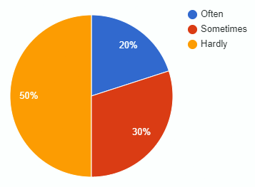

# Werkcollege AFO 24/09/24

## Falende Projecten

Uitbreiding op [Falende Projecten](2021-09-22-H.md#falende-projecten)

## Functionele en Niet-Functionele Requirements

Uitbreiding op [Functionele en Niet-Functionele Requirements](2021-09-22-H.md#functionele-en-niet-functionele-requirements)

### Opbouw

| Functioneel                      | Niet Functioneel                         |
|:-------------------------------- |:---------------------------------------- |
| Beschrijft functies              | Beschrijft eigenschappen                 |
| Wat het systeem moet doen        | Hoe het systeem het moet doen            |
| Beschrijft acties van gebruikers | Beschrijft user experience               |
| Beschreven met werkwoorden       | Beschreven met bijvoegelijke naamwoorden |

### Functioneel Voorbeelden

- Kopen van kaartje voor de trein
- Overzicht van werkzaamheden tonen
- Plannen van een rit van a naar b

### Niet-Functioneel Voorbeelden

- Niet een datum uit het verleden aanbieden voor het kopen van een treinkaartje
- De website moet dezelfde dingen verkopen als een ticket balie

### Checken

Om te kijken of de of de functionele en niet-functionele eisen kloppen ga je overleggen met de klant. Dan 

%%De functionele en niet-functionele requirements gaan naar de klant om te checken. Dan weet je of de requirements kloppen
%%