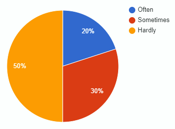

# Werkcollege AFO 24/09/24

## Inhoud

- [Falende projecten](#Falende%20projecten)
- [Functionele en niet-functionele requirements](#Functionele%20en%20niet-functionele%20requirements)

## Falende projecten

Uitbreiding op [Falende Projecten](AFO-2021-09-24-W.md#Falende%20Projecten)

## Functionele en niet-functionele requirements

Uitbreiding op [Functionele en niet-functionele requirements](AFO-2021-09-24-W.md#Functionele%20en%20Niet-Functionele%20Requirements)

### Opbouw

| Functioneel                      | Niet functioneel                         |
| :------------------------------- | :--------------------------------------- |
| Beschrijft functies              | Beschrijft eigenschappen                 |
| Wat het systeem moet doen        | Hoe het systeem het moet doen            |
| Beschrijft acties van gebruikers | Beschrijft user experience               |
| Beschreven met werkwoorden       | Beschreven met bijvoegelijke naamwoorden |

### Functioneel voorbeelden

- Kopen van kaartje voor de trein
- Overzicht van werkzaamheden tonen
- Plannen van een rit van a naar b

### Niet-functioneel voorbeelden

- Niet een datum uit het verleden aanbieden voor het kopen van een treinkaartje
- De website moet dezelfde dingen verkopen als een ticket balie

### Checken

Om te kijken of de of de functionele en niet-functionele eisen kloppen ga je overleggen met de klant. Dan kan de klant aangeven of alles klopt en of er nog veranderingen plaats moeten vinden. Daarna kun je weer verder.
