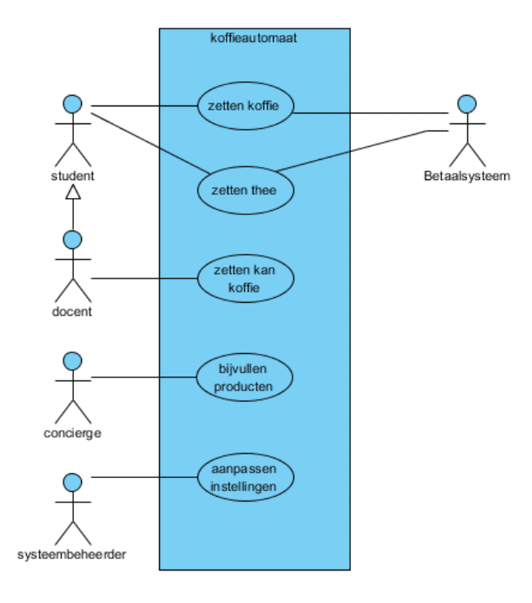

# AFO Werkcollege 05/10/2021

## Inhoud

[TODO]

## Usecase diagram

Een usecase diagram is een diagram waarmee je userstories beter in beeld kunt brengen.

Aan de linker kant staan de gebruikers van het systeem. Met pijlen word aangegeven of gebruikers dezelfde rechten hebben als een andere groep, zoals de `docent` alles kan doen wat een `student` kan, en meer.

In het midden staan functionaliteiten van het systeem. Deze zijn verbonden met de gebruikers die gebruik kunnen maken van deze functie. Zorg dat lijnen niet of zo min mogelijk overlappen. Dan is het diagram beter te lezen.

Aan de rechter kant worden de secundaire actoren aangegeven. Dit zijn externe systemen die al bestaan, of systemen die op andere locaties staan.

*2 punten op het examen: de rand en de titel. **Niet vergeten**.*