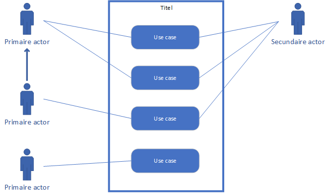

# Hoorcollege AFO 07/10/2021

## Inhoud

[TODO]

## Usecase

Een usecase is een hele korte "zin" waarin een functie van een systeem wordt weergegeven. Dit bestaat uit `werkwoord + zelfstandig naamwoord`. (zetten koffie, bijvullen bonen). Het **moet** in deze volgorde.

## User story vs usecase

| User story   | Usecase       |
| :----------- | :------------ |
| Waarde       | Systeem       |
| Planning     | Requirements  |
| Grote lijnen | Gedetailleerd |
| Analyse fase | Ontwerp fase  |

```ad-warning
title: Let op
Dit schema veranerd per bedrijf en project. Gebruik wat je team op dat moment gebruikt.
```

## Usecase diagram

_Uitbreiding op [Usecase diagram](AFO-2021-10-05-W.md#Usecase%20diagram)._

Een usecase diagram is een schema waar de [usecases](#Use%20case) worden weergeven. Er wordt aangegeven voor wie deze usecases zijn en welke externe systemen hier mee in aanraking zijn.

Zorg ervoor dat je de usecases klein houd. maak er geen grote zinnen van. Zorg ook dat je er niet te veel hebt. Hierdoor wordt je diagram slordig en minder goed leesbaar.



### Systeemgrens

Dit is de rand om de usecases heen. Een systeemgrens heeft altijd een titel.

### Primaire actoren

Een primaire actor is een gebruikersgroep of een rol in het systeem. Deze handelt met het systeem om usecases uit te voeren. Dat verbind je met lijnen.

#### Overerven

Om een spinnenweb te voorkomen kun je overerving gebruiken. Dit duid je aan met een pijl. De middelste primaire actor erft de acties van de bovenste. Hij kan dus alles wat de andere ook kan.

### Usecases

Dit zijn de blokken in de systeemgrens. Ze staan onder elkaar in een lijn en zijn verbonden met [primaire actoren](#Primaire%20actoren) en [secundaire actoren](#Secundaire%20actoren).

### Secundaire actoren

Secundaire actoren zijn systemen die buiten jou eigen systeem worden gebruikt. Dit zijn externe betaalsystemen en andere tools die gebruikt kunnen worden.

```ad-warning
title: Let op
Een database is **geen** secundaire actor.
```

## Usecase beschrijving

Hoewel een usecase heel kort is, is een usecase beschrijving veel langer.

[TODO]
