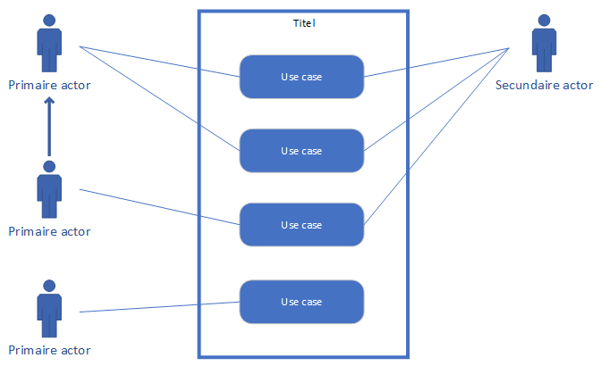

# Hoorcollege AFO 07/10/2021

## Inhoud

[TODO]

## Use case

Een use case is een hele korte "zin" waarin een functie van een systeem wordt weergegeven. Dit bestaat uit `werkwoord + zelfstandig naamwoord`. (zetten koffie, bijvullen bonen). Het **moet** in deze volgorde.

## User story vs use case

| User story   | Use case      |
| ------------ | ------------- |
| Waarde       | Systeem       |
| Planning     | Requirements  |
| Grote lijnen | Gedetailleerd |
| Analyse fase | Ontwerp fase  |

```ad-warning
title: Let op
Dit schema veranerd per bedrijf en project. Gebruik wat je team op dat moment gebruikt.
```

## Use case diagram

_Uitbreiding op_

Een use case diagram is een schema waar de [use cases](#Use%20case) worden weergeven. Er wordt aangegeven voor wie deze use cases zijn en welke externe systemen hier mee in aanraking zijn.



### Systeemgrens

Dit is de rand om de use cases heen. Een systeemgrens heeft altijd een titel.

### Primaire actoren

Een primaire actor is een gebruikersgroep of een rol in het systeem. Deze handelt met het systeem om use cases uit te voeren. Dat verbind je met lijnen.

#### Overerven

Om een spinnenweb te voorkomen kun je overerving gebruiken. Dit duid je aan met een pijl.

##
