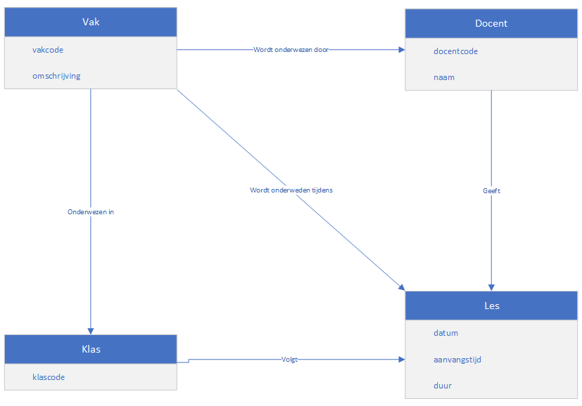

# Hoorcollege AFO 14/10/2021

## Inhoud

[TODO]

## Domeinmodel

Een domeinmodel geeft weer welke info een belangrijke rol speelt bij (een bepaald deel van) een project. Het is een conceptueel diagram zonder veel details. Alleen de dingen die relevant zijn worden weergegeven. Een domeinmodel bestaat uit klassen, attributen, associaties en multipliciteiten.

```ad-warning
title: Let op
Een klasnaam begint altijd met een hoofdletter en is altijd in elkelvoud.
```



*Dit is een simpel domeinmodel*

### Relaties

