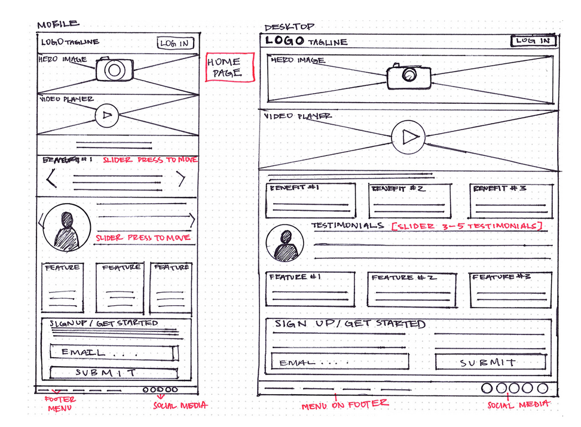

# Werkcollege AFO 27/10/2021

## Inhoud

- [Schermontwerp](#Schermontwerp)

## Schermontwerp

Een schermontwerp is een uitbreiding op een usecase beschrijving, maar kan er ook los van staan. Het is een ontwerp van een project of deel van een project. Maar zonder details, zoals kleuren, exacte afbeeldingen, icons, etc. Het is eigenlijk een nettere schets. De enige dingen die erop staan zijn grafische elementen

%%

- Verduidelijking van usecase beschrijving.
- Layout van het project (website, plattegrond, etc...)
- grafische controle elementen: elementen waar je mee kunt handelen (knoppen, lijsten, textvelden, etc...)

1. Schets
2. Wireframe
3. Mock-up
4. Prototype
   _Word steeds meer gedetailleerd. Je begint strikt functioneel_
%%