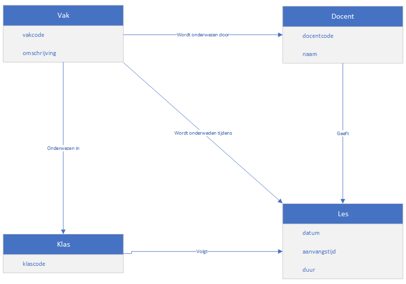

# Hoorcollege AFO 14/10/2021

## Inhoud

- [Domeinmodel](#Domeinmodel)

## Domeinmodel

Een domeinmodel geeft weer welke info een belangrijke rol speelt bij (een bepaald deel van) een project. Het is een conceptueel diagram zonder veel details. Alleen de dingen die relevant zijn worden weergegeven. Een domeinmodel bestaat uit:

- **Klassen**: Verzameling van vergelijkbare objecten.
- **Attributen**: Eigenschappen van een klasse.
- **Associaties**: Relaties tussen klassen.
- **Multipliciteiten**: Kwantische verhouding tussen klassen. Dit zijn de hoeveelheden of gebrek daaraan die bij de relaties horen.

```ad-warning
title: Let op
Een klasnaam begint altijd met een hoofdletter en is altijd in elkelvoud.
```



_Dit is een simpel domeinmodel_

### Relaties en multipliciteiten

De relaties tussen de tabellen worden aangevuld met nummers bij de lijnen. Deze zijn opgebouwd uit 2 getallen met twee punten ertussen, zoals `0..2`. Er zijn dus minimaal nul connecties, en maximaal 2. Als er een `*` staat, dan is dat een oneindig. Het maakt niet uit hoeveel connecties er zijn.


In het onderstaande diagram zijn de multipliciteiten toegevoegd.


```ad-tip
Je kunt de multipliciteit `0..*` vervangen door `*`. Dit betekent exact hetzelfde.
```

### Overerving

Je kunt met pijlen overerving van klassen aanduiden. Hieronder hebben Docent en Student dezelfde eigenschappen, op de code na. Zo kun je een overerving aangeven. Docent en Student nemen de eigenschappen van Persoon over. Net als alle relaties die erbij horen.


