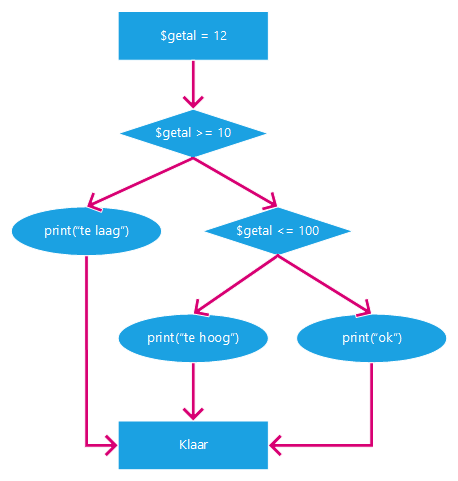

# Hoorcollege PHP 22/09/2021

## Inhoud

- [Variabelen](#Variabelen)
- [Operators](#Operators)
- [If Statements](#If%20Statements)

## Variabelen

Een variabele maak je met een `$` teken. Deze zet je voor de naam van de variabele.

```php
$variable = 'value'
```

Er zijn een paar typen variabelen die je kunt gebruiken. Onder andere een `int`, `string` en `bool`.

```php
$variable = 123      (int)
$variable = "value"  (string)
$variable = true     (bool)
```

```ad-info
title: Variabelen types
Variabelen kunnen van type veranderen, maar dit is niet handig om te doen. Dit kan namelijk veel foutmeldingen opleveren met debuggen.
```

## Operators

Er zijn een aantal operators in PHP. Hieronder staat een aantal uitgeschreven

|  Teken   | Uitleg                                     |
| :------: | :----------------------------------------- |
| `x == y` | **x** is gelijk aan **y**                  |
| `x >= y` | **x** is groter dan _of_ gelijk aan **y**  |
| `x > y`  | **x** is groter dan **y**                  |
| `x <= y` | **x** is kleiner dan _of_ gelijk aan **y** |
| `x < y`  | **x** is kleiner dan **y**                 |
| `x != y` | **x** is niet gelijk aan **y**             |

Je kunt ook getallen dingen met elkaar laten doen. Dit houd in keer, delen, etc.

|  Teken   | Uitleg                                            |
| :------: | :------------------------------------------------ |
| `x + y`  | Optellen -> Tel y bij x op                        |
| `x - y`  | Aftrekken -> Haal y van x af                      |
| `x * y`  | Vermenigvuldigen -> Vermenigvuldig x met y        |
| `x / y`  | Delen -> Deel x door y                            |
| `x % y`  | Modulus -> Geeft het restant van x gedeeld door y |
| `x ** y` | Exponentieel -> Doe x tot de y-de macht           |

Verder heb je opties om deze operators aan elkaar te linken of te inverteren.

| Teken | Uitleg                                                               |
| :---: | :------------------------------------------------------------------- |
| `&&`  | De waardes aan allebei de kanten van deze tekens moeten `true` zijn. |
| \|\|  | De waardes aan 1 de kanten van deze tekens moeten `true` zijn.       |
|  `!`  | De waarde achter dit teken wordt geïnverteerd.                       |

Met haakjes `()` kun je blokken aan elkaar linken en complexere statements maken

```php
if (x >= 0 && (y <= -10 || y >= 10)) {
	print("Hello World");
}
```

## If Statements

### If

Met een `if` statement kun je code laten uitvoeren als aan een bepaalde criteria voldaan wordt. Deze wordt aangegeven in haakjes `()`. Daarna "open" je het `if` "blok" met accolades `{}`.

_`If` statements kunnen ook genest worden inelkaar._

```php
if (true) {
	print("Hello World");
}
```

```php
if (true) {
	if (x >= 10) {
		print("Hello World");
	}
}
```

### Else

Een `else` blok kan worden vast gemaakt aan een `if` statement. Als je een `if` blok dan niet in gaat (de `if ()` is `false`), dan wordt de code in een `else` blok uitgevoerd.

```php
if ($x > 0) {
	print("Hello World");
} else {
	print("foo bar");
}
```

### Elseif

Als laatse bestaat er een `elseif`. Met dit kun je verschillende `if` blokken aan elkaar linken en zorgen dat er geen code uit de andere blokken wordt uitgevoerd. Uit een `if elseif else` blok wordt altijd maar 1 blok uitgevoerd.

```php
if ($x > 0) {
	print("Hello World");
} elseif ($x == -3) {
	print("foo");
} else {
	print("bar");
}
```

### Uitgetekend Diagram



```ad-tip
Dit schema is handig om te maken op papier. Dan kun je beter checken of alles goed gaat, en later check waar een error vandaan komt.
```
